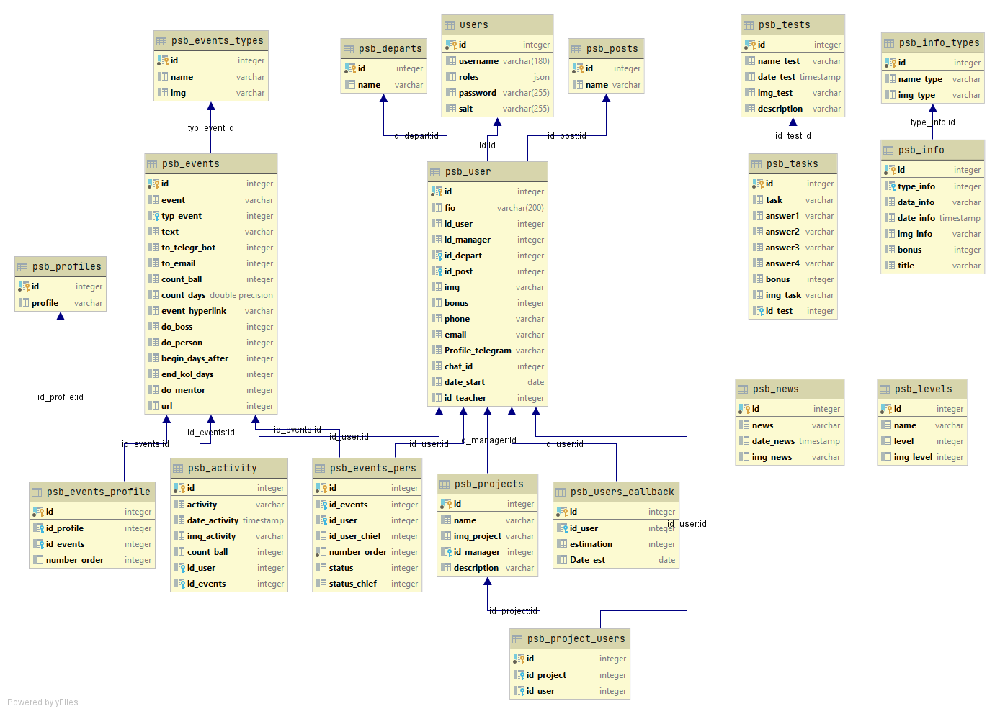

## Реализованная функциональность

Web-портал
Telegram bot

## Основной стек технологий

Postgresql 12
Symfony
PHP 7.4 + Composer
Telegram API

## Демо

Демо сервиса доступно по адресу: https://psb.robotrek24.ru/
Реквизиты пользователя: логин: 'user', пароль: 'test'
Реквизиты наставника: логин: 'techer', пароль: 'test'
Реквизиты руководителя: логин: 'admin', пароль: 'test'

## Среда запуска

Требуется установленный web-сервер с поддержкой PHP(версия 7.4+) интерпретации (apache, nginx);
Требуется установленная СУБД Postgresql (версия 12+);

## Установка

#### База данных

Необходимо создать пустую базу данных и развернуть дамп базы данных из папки db
Подключение к базе данных настроить в файле .env

#### Установка зависимостей проекта

Установка зависимостей осуществляется с помощью Composer. Если у вас его нет вы можете установить его по инструкции на getcomposer.org.
После этого выполнить команду в директории проекта:
composer install

## Схема базы данных

